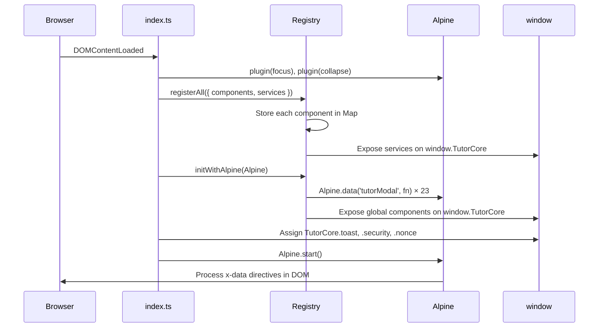

# Architecture

> How the core library initializes, registers components, and exposes APIs.

---

## Initialization Flow

The entry point is [`ts/index.ts`](../ts/index.ts). On `DOMContentLoaded` (or immediately if the DOM is already ready), `initializePlugin()` runs:

```
1. Alpine plugins loaded     → focus, collapse
2. Registry.registerAll()    → components[] + services[]
3. Registry.initWithAlpine() → Alpine.data('tutorModal', ...) for each component
4. window.TutorCore assigned → services + security + nonce helpers
5. Legacy functions bridged  → registerLegacyFunctions()
6. Alpine.start()            → Alpine initializes and discovers x-data directives
```

### Sequence Diagram



---

## Component Registry

**File:** [`ts/ComponentRegistry.ts`](../ts/ComponentRegistry.ts)

The `Registry` class is the central coordinator. It maintains two `Map`s:

| Map          | Key                             | Value                                                  |
| ------------ | ------------------------------- | ------------------------------------------------------ |
| `components` | Component name (e.g. `'modal'`) | `AlpineComponentMeta` — `{ name, component, global? }` |
| `services`   | Service name (e.g. `'toast'`)   | `ServiceMeta` — `{ name, instance }`                   |

### Registration

```typescript
// Single registration
TutorComponentRegistry.register({
  type: 'component',
  meta: { name: 'modal', component: modal }
});

// Bulk registration (used at init)
TutorComponentRegistry.registerAll({
  components: [modalMeta, tabsMeta, ...],
  services:   [toastServiceMeta, queryServiceMeta, ...]
});
```

### Alpine Integration

When `initWithAlpine(Alpine)` is called, each component is registered as an Alpine data function with the naming convention `tutor` + PascalCase(name):

| Component name    | Alpine directive                         |
| ----------------- | ---------------------------------------- |
| `modal`           | `x-data="tutorModal({ ... })"`           |
| `tabs`            | `x-data="tutorTabs({ ... })"`            |
| `accordion`       | `x-data="tutorAccordion({ ... })"`       |
| `select`          | `x-data="tutorSelect({ ... })"`          |
| `form`            | `x-data="tutorForm({ ... })"`            |
| `tooltip`         | `x-data="tutorTooltip({ ... })"`         |
| `popover`         | `x-data="tutorPopover({ ... })"`         |
| `toast`           | `x-data="tutorToast()"`                  |
| `fileUploader`    | `x-data="tutorFileUploader({ ... })"`    |
| `calendar`        | `x-data="tutorCalendar({ ... })"`        |
| `selectDropdown`  | `x-data="tutorSelectDropdown({ ... })"`  |
| `stepperDropdown` | `x-data="tutorStepperDropdown({ ... })"` |
| `timeInput`       | `x-data="tutorTimeInput({ ... })"`       |
| `icon`            | `x-data="tutorIcon({ ... })"`            |
| `button`          | `x-data="tutorButton({ ... })"`          |
| `statics`         | `x-data="tutorStatics({ ... })"`         |
| `starRating`      | `x-data="tutorStarRating({ ... })"`      |
| `player`          | `x-data="tutorPlayer({ ... })"`          |
| `passwordInput`   | `x-data="tutorPasswordInput({ ... })"`   |
| `copyToClipboard` | `x-data="tutorCopyToClipboard({ ... })"` |
| `wpEditor`        | `x-data="tutorWpEditor({ ... })"`        |
| `statusSelect`    | `x-data="tutorStatusSelect({ ... })"`    |
| `previewTrigger`  | `x-data="tutorPreviewTrigger({ ... })"`  |

### Lookup

```typescript
// Get a component meta
const meta = TutorComponentRegistry.get({ name: 'modal', type: 'component' });

// Get a service instance
const toast = TutorComponentRegistry.get<ToastService>({ name: 'toast', type: 'service' });

// Check existence
TutorComponentRegistry.has({ name: 'tabs', type: 'component' }); // true
```

---

## Type System

**File:** [`ts/types/index.ts`](../ts/types/index.ts)

### Core Interfaces

```typescript
// All components implement this shape
interface AlpineComponentMeta<TProps = any> {
  name: string;
  component: (props: TProps) => Record<string, any>;
  global?: boolean; // If true, exposed on window.TutorCore
}

// All services implement this shape
interface ServiceMeta<T = unknown> {
  name: string;
  instance: T;
}

// Standard AJAX response envelope
interface AjaxResponse<T = unknown> {
  status_code: number;
  success: boolean;
  message: string;
  data?: T;
}
```

### TutorCore Interface

The `TutorCore` interface describes the shape of `window.TutorCore`:

```typescript
interface TutorCore {
  // Components (exposed when global: true)
  button: (props) => ...;
  tabs: (props) => ...;
  icon: (props) => ...;
  // ... etc.

  // Services
  form: FormService;
  toast: ToastService;
  query: QueryService;
  modal: ModalService;
  wpMedia: WPMediaService;

  // Utilities (added in index.ts)
  security: { escapeHtml, escapeAttr };
  nonce: { getNonceData };
}
```

---

## Custom Events

**File:** [`ts/constant.ts`](../ts/constant.ts)

Components communicate via `CustomEvent`s dispatched on `document`:

| Constant                 | Event Name                     | Payload                     |
| ------------------------ | ------------------------------ | --------------------------- |
| `TAB_CHANGE`             | `tutor-tab-change`             | `{ tabId, tab }`            |
| `MODAL_OPEN`             | `tutor-modal-open`             | `{ id?, data? }`            |
| `MODAL_UPDATE`           | `tutor-modal-update`           | `{ id, data }`              |
| `MODAL_CLOSE`            | `tutor-modal-close`            | `{ id? }`                   |
| `MODAL_CLOSED`           | `tutor-modal-closed`           | `{ id }`                    |
| `TOAST_SHOW`             | `tutor-toast-show`             | `{ message, config }`       |
| `TOAST_CLEAR`            | `tutor-toast-clear`            | —                           |
| `FORM_REGISTER`          | `tutor-form-register`          | `{ id, instance }`          |
| `FORM_UNREGISTER`        | `tutor-form-unregister`        | `{ id }`                    |
| `FORM_STATE_CHANGE`      | `tutor-form-state-change`      | `{ id, isDirty }`           |
| `FORM_RESET`             | `tutor-form-reset`             | `{ formId, defaultValues }` |
| `WP_EDITOR_FOCUS`        | `wp-editor-focus`              | —                           |
| `TUTOR_PLAYER_READY`     | `tutor-player-ready`           | —                           |
| `COMMENT_REPLIED`        | `tutor:comment:replied`        | —                           |
| `LESSON_PLAYER_READY`    | `tutorLessonPlayerReady`       | —                           |
| `QUIZ_TIME_EXPIRED`      | `tutor-quiz-time-expired`      | —                           |
| `QUIZ_ABANDON_REQUESTED` | `tutor-quiz-abandon-requested` | —                           |
| `QUIZ_ATTEMPT_COMPLETED` | `tutor-quiz-attempt-completed` | —                           |

### Listening Example

```javascript
document.addEventListener('tutor-modal-closed', (event) => {
  console.log('Modal closed:', event.detail.id);
});
```
