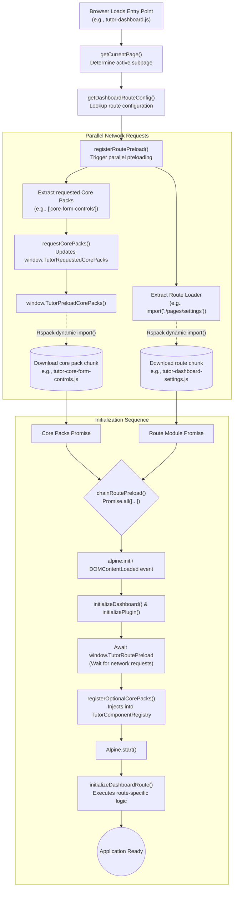

# Frontend Code Splitting Guide & API Reference

This document explains how code-splitting is implemented in the Tutor LMS frontend using Rspack, TypeScript, and dynamic imports, and provides an API reference for developers working within this architecture.

Code splitting significantly improves website performance by breaking down large JavaScript bundles into smaller chunks, loading only the code necessary for the user's current view or interaction.

## Architecture Overview

The code splitting architecture in this repository operates on two primary levels:

1. **Route-Based Splitting**: Pages like the Dashboard and Learning Area are split into individual chunks based on their subpages (e.g., `my-courses`, `quiz-attempts`).
2. **Core Pack Splitting**: Heavy shared functionalities (e.g., media editors, form controls) are abstracted into "Core Packs" and loaded only when a specific route explicitly requests them.

### High-Level Architecture Diagram



### 1. Rspack Configuration

Code splitting is fundamentally enabled by the bundler. In `rspack.config.mjs`, specific optimizations and chunking strategies are defined:

> [!TIP]
> **Dynamic Chunk Naming:** Notice the use of `chunkFilename: 'js/lazy-chunks/[name].js'`. This ensures that all dynamically imported files are separated from the main entry points and placed in a dedicated directory.

- **Split Chunks**: The `optimization.splitChunks` configuration targets `async` chunks.
- **Shared Async Modules**: The `tutorAsyncCommon` cache group automatically extracts shared dependencies across multiple async chunks into a common file if they are used at least twice. This prevents code duplication across different lazy-loaded pages.

### 2. Core Pack Code Splitting

Not every page needs a rich text editor or complex form controls. In `assets/core/ts/index.ts`, core functionalities are mapped to dynamic imports:

```typescript
const optionalCorePackLoaders: Record<OptionalTutorCorePackName, () => Promise<CorePackModule>> = {
  'core-form-controls': async () => {
    const module = await import(/* webpackChunkName: "tutor-core-form-controls" */ '@Core/ts/packs/form-controls');
    return { register: module.registerCoreFormControlsPack };
  },
  // ...
};
```

Using the `/* webpackChunkName: "..." */` magic comment tells Rspack exactly what to name the generated chunk file. When `preloadOptionalCorePacks` is called, it triggers these promises, downloading the network payload only when necessary.

### 3. Route-Based Code Splitting

The entry points for major SPA-like areas (like the Instructor Dashboard and Learning Area) do not include the code for all their tabs.

In `assets/src/js/frontend/dashboard/index.ts` and `assets/src/js/frontend/learning-area/index.ts`:

```typescript
const dashboardRoutes: Record<string, TutorRouteConfig<DashboardRouteModule>> = {
  'my-courses': createRouteConfig(withBasePack(), async () => {
    const { initializeMyCourses } = await import(
      /* webpackChunkName: "tutor-dashboard-my-courses" */ './pages/my-courses'
    );
    return { initializeDashboardRoute: initializeMyCourses };
  }),
  settings: createRouteConfig(withBasePack('core-form-controls', 'core-media-editor'), async () => {
    const { initializeSettings } = await import(/* webpackChunkName: "tutor-dashboard-settings" */ './pages/settings');
    return { initializeDashboardRoute: initializeSettings };
  }),
};
```

> [!NOTE]
> The `settings` route explicitly requires `core-form-controls` and `core-media-editor`. If the user navigates to the settings page, the route config guarantees that both the settings chunk and the required core packs are fetched.

### 4. Preloading Infrastructure

To prevent a waterfall of network requests (e.g., waiting for a route to load before realizing it needs a core pack), the application coordinates preloading using `assets/src/js/frontend/route-preload.ts`.

The `registerRoutePreload` function is invoked immediately upon script execution. It uses `Promise.all` to fetch both the route module chunk and the requested core pack chunks **in parallel**:

```typescript
export const registerRoutePreload = <TModule>(...) => {
  const preloadedRouteModule = routeConfig ? routeConfig.load() : null;
  const corePackPreload = requestCorePacks(routeConfig?.packs || defaultPacks);

  // Chains both promises so the application only initializes when everything is ready
  return chainRoutePreload(corePackPreload, preloadRoute());
};
```

### Performance Benefits

1. **Reduced Initial TTI (Time to Interactive)**: The `tutor-dashboard.js` and `tutor-learning-area.js` entry points remain lightweight because they only contain the routing logic and common infrastructure.
2. **Efficient Caching**: Because chunks are split by feature, an update to the "quiz" code only changes the `tutor-learning-quiz.js` chunk. The browser can continue to use the cached versions of other pages.
3. **Bandwidth Savings**: Students only download the code for the specific view they are interacting with.

---

## API Reference

### Types & Interfaces

#### `TutorRouteConfig<TModule>`

Defines the dependencies and the chunk-loading mechanism for a specific route.

```typescript
type TutorRouteConfig<TModule> = {
  packs: TutorCorePackName[];
  load: () => Promise<TModule>;
};
```

- `packs`: An array of Core Pack names (e.g., `'core-base'`, `'core-form-controls'`) required by this route.
- `load`: A function that returns a Promise resolving to the module containing the route's initialization logic (usually containing a dynamic `import()`).

#### `RegisterRoutePreloadArgs<TModule>`

Arguments passed to the `registerRoutePreload` method.

```typescript
type RegisterRoutePreloadArgs<TModule> = {
  routeConfig?: TutorRouteConfig<TModule>;
  beforeLoad?: () => void | Promise<void>;
  initializeRoute: (routeModule: TModule) => void | Promise<void>;
  defaultPacks?: TutorCorePackName[];
};
```

- `routeConfig`: The configuration returned by `createRouteConfig`. If `undefined`, only `defaultPacks` will be loaded.
- `beforeLoad`: Optional callback executed before the route module promise resolves (e.g., used to initialize common components like headers or sidebars).
- `initializeRoute`: The callback that receives the downloaded chunk module, where route-specific scripts are executed.
- `defaultPacks`: Fallback core packs to load if no `routeConfig` is matched. Defaults to `['core-base']`.

---

### Route Configuration Utilities

#### `createRouteConfig<TModule>`

A helper function to generate a valid `TutorRouteConfig`.

```typescript
function createRouteConfig<TModule>(
  packs: TutorCorePackName[],
  load: () => Promise<TModule>,
): TutorRouteConfig<TModule>;
```

**Example Usage:**

```typescript
import { createRouteConfig, withBasePack } from '../route-preload';

const route = createRouteConfig(withBasePack('core-media-editor'), async () => {
  const module = await import(/* webpackChunkName: "tutor-dashboard-settings" */ './pages/settings');
  return { initializeDashboardRoute: module.initializeSettings };
});
```

#### `withBasePack`

A utility function that ensures the mandatory `core-base` pack is always included in the required dependencies.

```typescript
function withBasePack(...packs: OptionalTutorCorePackName[]): TutorCorePackName[];
```

**Example Usage:**

```typescript
const dependencies = withBasePack('core-form-controls', 'core-learning');
// Returns: ['core-base', 'core-form-controls', 'core-learning']
```

---

### Preloading & Initialization API

#### `registerRoutePreload<TModule>`

The primary entry point to trigger chunk downloading. It orchestrates the parallel loading of Core Packs and the specific Route Module.

```typescript
function registerRoutePreload<TModule>(args: RegisterRoutePreloadArgs<TModule>): Promise<void>;
```

**Behavior:**

1. Triggers `requestCorePacks` with the required packs.
2. Triggers the route's `load()` dynamic import.
3. Chains both promises to the global `window.TutorRoutePreload`.
4. Awaits download, executes `beforeLoad`, and finally executes `initializeRoute` with the downloaded module.

#### `requestCorePacks`

Directly requests the system to download specified Core Packs. It manages a `Set` in `window.TutorRequestedCorePacks` to prevent duplicate network requests.

```typescript
function requestCorePacks(packs: TutorCorePackName[]): Promise<void>;
```

> [!NOTE]
> This is internally called by `registerRoutePreload`, but can be called manually if a component needs to lazily load a core pack long after the initial page load (e.g., user clicks a button to open a modal containing an editor).

#### `chainRoutePreload`

Combines an array of Promises and merges them into the global `window.TutorRoutePreload` Promise.

```typescript
function chainRoutePreload(...promises: Promise<unknown>[]): Promise<void>;
```

**Why this exists:**
The core plugin initialization (`assets/core/ts/index.ts`) pauses its boot sequence (and Alpine initialization) by `await`-ing `window.TutorRoutePreload`. By chaining custom chunk loading promises here, developers guarantee that the DOM will not hydrate until all necessary lazy-loaded JavaScript is available.

---

## Step-by-Step Guide: Adding a New Split Route

This guide walks through the process of adding a new lazy-loaded page to an existing entry point (e.g., adding a new tab to the Dashboard).

### Step 1: Create the Page Module

Create your feature module. This code will be separated into its own chunk. Ensure you export an initialization function.

```typescript
// assets/src/js/frontend/dashboard/pages/my-new-feature.ts

export const initializeMyNewFeature = () => {
  console.log('New feature chunk loaded and initialized!');
  // ... Alpine component registration, event listeners, etc.
};
```

### Step 2: Define the Route Configuration

In your area's main router (e.g., `assets/src/js/frontend/dashboard/index.ts`), map your new page slug to a Route Config.

1. Locate the `dashboardRoutes` object.
2. Use `createRouteConfig` to define the dependencies and the dynamic import.
3. **CRUCIAL**: Add the Rspack magic comment (`/* webpackChunkName: "..." */`) so the chunk is properly named.

```typescript
const dashboardRoutes: Record<string, TutorRouteConfig<DashboardRouteModule>> = {
  // ... existing routes

  'my-new-feature': createRouteConfig(
    // 1. Define required core packs (e.g., we need the media editor)
    withBasePack('core-media-editor'),

    // 2. Define the dynamic loader
    async () => {
      const module = await import(/* webpackChunkName: "tutor-dashboard-new-feature" */ './pages/my-new-feature');

      // 3. Return the interface expected by your route module type
      return {
        initializeDashboardRoute: module.initializeMyNewFeature,
      };
    },
  ),
};
```

### Step 3: Verify the Rspack Build

Run your development or production build command:

```bash
npm run dev
# or
npm run build
```

Check the build output. You should see a new file generated in the chunk directory:
`assets/js/lazy-chunks/tutor-dashboard-new-feature.js`

### Step 4: Test in the Browser

1. Navigate to the page that triggers your route (e.g., `?subpage=my-new-feature`).
2. Open the browser's Network tab.
3. Verify that `tutor-dashboard-new-feature.js` and `tutor-core-media-editor.js` are downloaded in parallel.
4. Verify that your `initializeMyNewFeature` logic executes correctly after the downloads complete.
