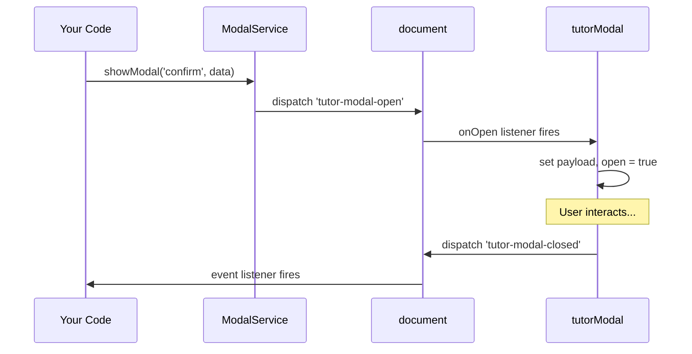

# Services

> Global service singletons exposed on `window.TutorCore`.

Services are registered with the `ComponentRegistry` and immediately exposed on `window.TutorCore[serviceName]`. Unlike components, they are **not** tied to DOM elements — you call their methods imperatively from anywhere.

---

## ToastService

**File:** [`ts/services/Toast.ts`](../ts/services/Toast.ts) &nbsp;|&nbsp; **Access:** `TutorCore.toast`

Programmatic API for showing toast notifications. Automatically injects a container into the DOM on first use. Handles fullscreen mode by moving the container into the fullscreen element.

### Methods

| Method    | Signature                                 | Description                            |
| --------- | ----------------------------------------- | -------------------------------------- |
| `show`    | `(message: string, config?: ToastConfig)` | Show a toast with custom configuration |
| `success` | `(message: string, duration?: number)`    | Show a success toast                   |
| `error`   | `(message: string, duration?: number)`    | Show an error toast                    |
| `warning` | `(message: string, duration?: number)`    | Show a warning toast                   |
| `info`    | `(message: string, duration?: number)`    | Show an info toast                     |
| `clear`   | `()`                                      | Remove all active toasts               |

### ToastConfig

```typescript
interface ToastConfig {
  type?: 'success' | 'error' | 'warning' | 'info'; // Default: 'info'
  duration?: number; // Auto-dismiss in ms (default: 5000, 0 = persistent)
  title?: string; // Custom title (defaults to localized type name)
}
```

### Usage

```javascript
// Simple usage
TutorCore.toast.success('Course saved successfully!');
TutorCore.toast.error('Failed to delete course');

// With custom config
TutorCore.toast.show('Processing...', {
  type: 'info',
  duration: 0, // Won't auto-dismiss
  title: 'Please wait',
});

// Clear all
TutorCore.toast.clear();
```

### How It Works

1. On first `show()` call, injects a `<div x-data="tutorToast()">` container into `document.body`
2. Initializes Alpine on the injected element
3. Dispatches `tutor-toast-show` CustomEvent to the container's Alpine component
4. On `fullscreenchange`, moves the container into the fullscreen element

---

## ModalService

**File:** [`ts/services/Modal.ts`](../ts/services/Modal.ts) &nbsp;|&nbsp; **Access:** `TutorCore.modal`

Programmatic API for opening, updating, and closing modals by ID.

### Methods

| Method        | Signature                       | Description                                        |
| ------------- | ------------------------------- | -------------------------------------------------- |
| `showModal`   | `(id?: string, data?: unknown)` | Open a modal, optionally passing data as `payload` |
| `updateModal` | `(id: string, data: unknown)`   | Update modal data without re-opening               |
| `closeModal`  | `(id?: string)`                 | Close a modal; omit ID to close the active one     |

### Usage

```javascript
// Open a modal with data
TutorCore.modal.showModal('delete-confirm', {
  courseId: 123,
  courseName: 'React Basics',
});

// Close it
TutorCore.modal.closeModal('delete-confirm');
```

### Event Flow



---

## FormService

**File:** [`ts/services/Form.ts`](../ts/services/Form.ts) &nbsp;|&nbsp; **Access:** `TutorCore.form`

Enables external code to interact with `tutorForm` instances by ID. Forms auto-register via the `tutor-form-register` event when initialized with an `id`.

### Methods

| Method         | Signature                        | Description                               |
| -------------- | -------------------------------- | ----------------------------------------- |
| `getValues`    | `(id) → Record`                  | Get all form values                       |
| `getValue`     | `(id, name) → unknown`           | Get a single field value                  |
| `setValue`     | `(id, name, value, options?)`    | Set a field value                         |
| `setValues`    | `(id, values, options?)`         | Set multiple field values                 |
| `reset`        | `(id, values?)`                  | Reset form to defaults or provided values |
| `trigger`      | `(id, name?) → Promise<boolean>` | Trigger validation                        |
| `clearErrors`  | `(id, name?)`                    | Clear validation errors                   |
| `setError`     | `(id, name, error)`              | Set a custom error                        |
| `setFocus`     | `(id, name, options?)`           | Focus a specific field                    |
| `getFormState` | `(id) → FormState`               | Get complete form state snapshot          |
| `watch`        | `(id, name) → unknown`           | Watch a field value                       |
| `hasForm`      | `(id) → boolean`                 | Check if a form is registered             |

### Usage

```javascript
// Check if a form exists
if (TutorCore.form.hasForm('course-form')) {
  // Get all values
  const values = TutorCore.form.getValues('course-form');

  // Set a value with validation
  TutorCore.form.setValue('course-form', 'price', 29.99, {
    shouldValidate: true,
    shouldDirty: true,
  });

  // Trigger validation
  const isValid = await TutorCore.form.trigger('course-form');

  // Reset
  TutorCore.form.reset('course-form', { title: '', price: 0 });
}
```

---

## QueryService

**File:** [`ts/services/Query.ts`](../ts/services/Query.ts) &nbsp;|&nbsp; **Access:** `TutorCore.query`

TanStack Query-inspired data fetching with caching, stale detection, and mutations. Uses `Alpine.reactive()` for reactive state.

### `useQuery(queryKey, queryFn, options?)`

Create a reactive query with automatic caching.

```typescript
interface QueryOptions {
  cacheTime?: number; // Not currently used (reserved)
  staleTime?: number; // Time in ms before data is considered stale (default: 0)
  enabled?: boolean; // Whether to auto-fetch (default: true)
}
```

**Returns:** `QueryState<TData, TError>`

| Property     | Type             | Description                               |
| ------------ | ---------------- | ----------------------------------------- |
| `data`       | `TData \| null`  | Fetched data                              |
| `error`      | `TError \| null` | Fetch error                               |
| `isLoading`  | `boolean`        | First load in progress                    |
| `isFetching` | `boolean`        | Any fetch in progress (including refetch) |
| `isStale`    | `boolean`        | Data exists but is stale                  |

| Method        | Description                                |
| ------------- | ------------------------------------------ |
| `fetchData()` | Fetch data from the query function         |
| `refetch()`   | Re-fetch data (does not reset `isLoading`) |

#### Usage

```javascript
const courseQuery = TutorCore.query.useQuery(
  ['courses', { page: 1 }],
  () => fetch('/api/courses?page=1').then((r) => r.json()),
  { staleTime: 30000 }, // 30 seconds
);

// Reactive properties
console.log(courseQuery.data); // null → courses[]
console.log(courseQuery.isLoading); // true → false
```

### `useMutation(mutationFn, options?)`

Create a mutation for data modification.

```typescript
interface MutationOptions<TData, TVariables, TError> {
  onMutate?: (variables) => void | Promise<void>; // Before mutation (optimistic updates)
  onSuccess?: (data, variables) => void | Promise<void>;
  onError?: (error, variables) => void;
  onSettled?: (data, error, variables) => void; // Always called
}
```

**Returns:** `MutationState<TData, TVariables, TError>`

| Property    | Type             | Description          |
| ----------- | ---------------- | -------------------- |
| `data`      | `TData \| null`  | Mutation result      |
| `error`     | `TError \| null` | Mutation error       |
| `isPending` | `boolean`        | Mutation in progress |
| `isError`   | `boolean`        | Mutation failed      |
| `isSuccess` | `boolean`        | Mutation succeeded   |

| Method                   | Description                      |
| ------------------------ | -------------------------------- |
| `mutate(variables)`      | Execute the mutation             |
| `mutateAsync(variables)` | Same as mutate (returns Promise) |
| `reset()`                | Reset state to initial           |

#### Usage

```javascript
const saveCourse = TutorCore.query.useMutation(
  (courseData) =>
    fetch('/api/courses', {
      method: 'POST',
      body: JSON.stringify(courseData),
    }).then((r) => r.json()),
  {
    onSuccess: (data, variables) => {
      TutorCore.toast.success('Course saved!');
      TutorCore.query.invalidateQueries('courses');
    },
    onError: (error) => {
      TutorCore.toast.error(error.message);
    },
  },
);

// Execute
await saveCourse.mutate({ title: 'New Course', price: 19.99 });
```

### Cache Management

| Method                       | Description                                       |
| ---------------------------- | ------------------------------------------------- |
| `invalidateQuery(queryKey)`  | Invalidate and refetch a specific query           |
| `invalidateQueries(pattern)` | Invalidate all queries matching a pattern         |
| `getCacheInfo(queryKey)`     | Get cache status string (e.g. `"Cached 15s ago"`) |
| `clearCache()`               | Clear all cached data                             |

---

## WPMediaService

**File:** [`ts/services/WPMedia.ts`](../ts/services/WPMedia.ts) &nbsp;|&nbsp; **Access:** `TutorCore.wpMedia`

Type-safe wrapper around WordPress `wp.media` modal for file selection.

### Methods

| Method        | Signature                                             | Description                  |
| ------------- | ----------------------------------------------------- | ---------------------------- |
| `isAvailable` | `() → boolean`                                        | Check if `wp.media` exists   |
| `open`        | `(options, onSelect, existingIds?) → cleanup \| null` | Open the media library modal |

### WPMediaOptions

```typescript
interface WPMediaOptions {
  title?: string; // Modal title (default: 'Select File')
  button?: { text?: string }; // Button text (default: 'Use this file')
  multiple?: boolean | 'add'; // Allow multi-select
  library?: { type?: string }; // Filter by media type ('image', 'video', etc.)
  maxFileSize?: number; // Max file size in bytes
  maxFiles?: number; // Max number of selections
}
```

### WPMedia (Selected File)

```typescript
interface WPMedia {
  id: number;
  title: string;
  url: string;
  name?: string; // filename
  size?: string; // human-readable size
  size_bytes?: number;
  ext?: string; // file extension
  mime?: string; // MIME type
}
```

### Usage

```javascript
const cleanup = TutorCore.wpMedia.open(
  {
    title: 'Select Course Thumbnail',
    library: { type: 'image' },
    maxFileSize: 5 * 1024 * 1024, // 5MB
  },
  (files) => {
    console.log('Selected:', files[0].url);
  },
  [existingAttachmentId], // Pre-select
);

// Later: cleanup event listeners
cleanup?.();
```

---

## PreferenceService

**File:** [`ts/services/Preference.ts`](../ts/services/Preference.ts) &nbsp;|&nbsp; **Access:** `TutorCore.preference`

Manages theme switching (light/dark/system) and font scaling.

### Methods

| Method           | Signature                                | Description                                          |
| ---------------- | ---------------------------------------- | ---------------------------------------------------- |
| `applyTheme`     | `(theme: 'dark' \| 'light' \| 'system')` | Apply a theme to `[data-tutor-theme]`                |
| `applyFontScale` | `(scale: number \| string)`              | Set root font size as percentage (e.g. `120` = 120%) |

### Properties

| Property      | Type                | Description                                              |
| ------------- | ------------------- | -------------------------------------------------------- |
| `activeTheme` | `'dark' \| 'light'` | The currently applied theme (resolved, never `'system'`) |

### Usage

```javascript
// Theme switching
TutorCore.preference.applyTheme('dark');
TutorCore.preference.applyTheme('system'); // Auto-detect from OS

// Font scaling for accessibility
TutorCore.preference.applyFontScale(120); // 120% = larger text
TutorCore.preference.applyFontScale(80); // 80% = smaller text

// Read current theme
console.log(TutorCore.preference.activeTheme); // 'dark' or 'light'
```

### System Theme Detection

When `applyTheme('system')` is called, the service:

1. Reads `prefers-color-scheme: dark` media query
2. Applies the matching theme
3. Adds a `change` listener to auto-switch when the OS preference changes
