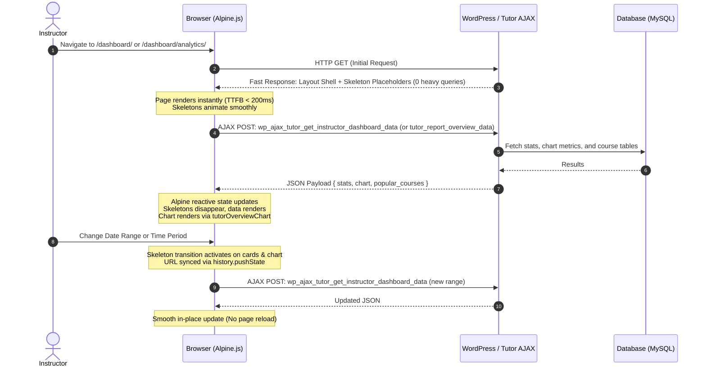

# Research: Adding AJAX Support & Skeleton Lazyloading to Instructor Dashboard & Report Pages

**Date:** 2026-08-29  
**Target:** Tutor LMS (`tutor`) & Tutor LMS Pro (`tutor-pro`)  
**Scope:** Instructor Frontend Dashboard (`/dashboard/`) & Tutor Report / Analytics Addon (`/dashboard/analytics/` & `/wp-admin/admin.php?page=tutor-report`)

---

## 1. Executive Summary & Current State

A thorough investigation of the primary source code across both `tutor` and `tutor-pro` repositories reveals that **neither the Instructor Dashboard nor the Report/Analytics pages have any AJAX lazyloading or skeleton loaders**.

### Key Findings from Primary Sources:

### 1.1 Instructor Dashboard Home ([`templates/dashboard/instructor/home.php`](file:///Users/blind/Local%20Sites/themeum-tutor/app/public/wp-content/plugins/tutor/templates/dashboard/instructor/home.php#L31-L252))

- **11 Synchronous Database Queries on Main Thread**:
  1. Instructor course IDs (`CourseModel::get_courses_by_args`)
  2. Total earnings calculation (`Analytics::get_earnings_by_user` or `WithdrawModel::get_withdraw_summary`)
  3. Total courses count (`CourseModel::get_course_count_by_date`)
  4. Total students enrolled (`tutor_utils()->get_total_students_by_instructor`)
  5. Instructor ratings average (`tutor_utils()->get_instructor_ratings`)
  6. Previous period comparison stats (when date range is active)
  7. Earnings & enrollment timeline data (`Analytics::get_total_students_by_user`)
  8. Course completion distribution (`Instructor::get_course_completion_distribution_data_by_instructor`)
  9. Top performing courses (`Instructor::get_top_performing_courses_by_instructor`)
  10. Upcoming live tasks & meetings (`Instructor::get_instructor_upcoming_live_tasks`)
  11. Recent reviews (`tutor_utils()->get_reviews_by_instructor`)
- **Full Page Reloads on Any Filter Change**:
  - `DateFilter` changes trigger `window.location.href` via [`assets/core/ts/components/calendar.ts:L504`](file:///Users/blind/Local%20Sites/themeum-tutor/app/public/wp-content/plugins/tutor/assets/core/ts/components/calendar.ts#L504).
  - Sorting top performing courses (Revenue vs. Students) triggers a full HTTP navigation via [`templates/dashboard/instructor/home/top-performing-course-filter.php:L43`](file:///Users/blind/Local%20Sites/themeum-tutor/app/public/wp-content/plugins/tutor/templates/dashboard/instructor/home/top-performing-course-filter.php#L43).

### 1.2 Report / Analytics Pages in Tutor Pro ([`tutor-pro/addons/tutor-report/`](file:///Users/blind/Local%20Sites/themeum-tutor/app/public/wp-content/plugins/tutor-pro/addons/tutor-report))

The Report addon provides reporting both on the **Frontend Instructor Dashboard** (`/dashboard/analytics/`) and the **WP-Admin Dashboard** (`wp-admin/admin.php?page=tutor-report`):

- **Frontend Overview ([`tutor-report/templates/overview.php`](file:///Users/blind/Local%20Sites/themeum-tutor/app/public/wp-content/plugins/tutor-pro/addons/tutor-report/templates/overview.php#L42-L198))**:
  - Executes synchronous queries for 3 Overview Cards (`CourseModel::get_courses_by_instructor`, `get_total_students_by_instructor`, `get_reviews_by_instructor`).
  - Executes 4 distinct heavy analytics queries for the Earnings Graph tabs (`get_earnings_by_user`, `get_total_students_by_user`, `get_discounts_by_user`, `get_refunds_by_user`).
  - Runs `Analytics::prepare_chart_data()` 4 times in PHP and embeds massive JSON objects into `x-data='tutorTabs(...)'`.
  - Executes `most_popular_courses(7)` and loops over every course running `get_course_rating()` (N+1 query problem).
  - Changing period tabs (`today`, `monthly`, `yearly`) or `DateFilter` causes a full page reload (`window.location.href = url`).
- **Frontend Sub-tabs ([`tutor-report/templates/`](file:///Users/blind/Local%20Sites/themeum-tutor/app/public/wp-content/plugins/tutor-pro/addons/tutor-report/templates))**:
  - `courses.php`, `earnings.php`, `statements.php`, and `students.php` each execute paginated SQL queries synchronously on initial render.
- **WP-Admin Report Pages ([`tutor-report/views/pages/`](file:///Users/blind/Local%20Sites/themeum-tutor/app/public/wp-content/plugins/tutor-pro/addons/tutor-report/views/pages))**:
  - Still relies on legacy jQuery (`tutor-pro/addons/tutor-report/assets/src/js/report.js`) with `window.location = urlPrams(...)`.

### 1.3 Existing Skeleton State:

- **CSS Tokens & Keyframes Exist**: `.tutor-skeleton`, `.tutor-skeleton-round`, and `@keyframes wave` exist in [`assets/core/scss/components/_skeleton.scss`](file:///Users/blind/Local%20Sites/themeum-tutor/app/public/wp-content/plugins/tutor/assets/core/scss/components/_skeleton.scss).
- **No PHP Skeleton Component**: No `Skeleton.php` exists in [`components/`](file:///Users/blind/Local%20Sites/themeum-tutor/app/public/wp-content/plugins/tutor/components).
- **No Skeleton Templates**: No skeleton placeholders or templates exist anywhere in the dashboard or report views.

---

## 2. Unified Architecture: Dashboard Home & Report Lazyloading

Both the Instructor Dashboard Home and the Report/Analytics Overview share identical technical requirements:

1. Stat/KPI Cards (Numbers + percentage change + icon).
2. Charts (Timeline line/area charts driven by `tutorOverviewChart`).
3. Tables (Course lists, ratings, learner counts).

### Architectural Solution: Consolidated AJAX JSON Hydration + Reusable Skeletons



---

## 3. Detailed Component Plan

### 3.1 PHP Skeleton Component (`Tutor\Components\Skeleton`)

Create a first-class UI component extending `BaseComponent`:

```php
namespace Tutor\Components;

class Skeleton extends BaseComponent {
    protected $width = '100%';
    protected $height = '16px';
    protected $rounded = 'md'; // sm, md, lg, full, circle
    protected $count = 1;
    protected $type = 'line'; // line, card, chart, table-row, avatar

    public static function make() { return new static(); }
    public function width( $width ) { $this->width = $width; return $this; }
    public function height( $height ) { $this->height = $height; return $this; }
    public function rounded( $radius ) { $this->rounded = $radius; return $this; }
    public function count( int $count ) { $this->count = $count; return $this; }
    public function type( string $type ) { $this->type = $type; return $this; }
    public function get(): string { ... }
}
```

### 3.2 Skeleton Template Partials

1. **Stat Cards Skeleton**: 4 cards with icon circle + label bar + value bar.
2. **Chart Skeleton**: Header bar + large rectangular canvas placeholder with animated wave (~240px height).
3. **Table Skeleton**: Table header + 5-7 rows of thumbnail placeholder + title bars + rating dots.

### 3.3 Backend AJAX Handlers

1. **For Dashboard Home**:
   - Action: `wp_ajax_tutor_get_instructor_dashboard_data`
   - Class: `TUTOR\Instructor`
   - Parameters: `start_date`, `end_date`, `type` (revenue/student)
   - Checks: `tutor_utils()->checking_nonce()`, `User::is_instructor()`
   - Response: `JsonResponse::response_success( '', $dashboard_data )`
2. **For Report / Analytics Overview**:
   - Action: `wp_ajax_tutor_get_instructor_analytics_data`
   - Class: `TUTOR_REPORT\Analytics`
   - Parameters: `period`, `start_date`, `end_date`
   - Checks: Nonce check, `tutor()->instructor_role` capability
   - Response: `JsonResponse::response_success( '', $analytics_data )`

### 3.4 Frontend Integration via Alpine & `QueryService`

In [`assets/src/js/frontend/dashboard/pages/instructor/home.ts`](file:///Users/blind/Local%20Sites/themeum-tutor/app/public/wp-content/plugins/tutor/assets/src/js/frontend/dashboard/pages/instructor/home.ts) and report scripts:

- Leverage `window.TutorCore.query.useQuery(['dashboard-data', params], fetcher)`
- `isLoading`: Automatically controls skeleton visibility (`x-show="isLoading"`) and data visibility (`x-show="!isLoading"`).
- Caching: Recent date ranges are cached in memory via `QueryCache`, making back-and-forth filtering instantaneous without network roundtrips.

---

## 4. Primary Source Reference Index

| File / Component         | Repository  | Source Path                                                                                                                                                                                            | Role / Findings                                                           |
| :----------------------- | :---------- | :----------------------------------------------------------------------------------------------------------------------------------------------------------------------------------------------------- | :------------------------------------------------------------------------ |
| Instructor Home Template | `tutor`     | [`templates/dashboard/instructor/home.php`](file:///Users/blind/Local%20Sites/themeum-tutor/app/public/wp-content/plugins/tutor/templates/dashboard/instructor/home.php)                               | 11 synchronous heavy queries blocking TTFB.                               |
| Report Frontend Wrapper  | `tutor-pro` | [`addons/tutor-report/templates/frontend_analytics.php`](file:///Users/blind/Local%20Sites/themeum-tutor/app/public/wp-content/plugins/tutor-pro/addons/tutor-report/templates/frontend_analytics.php) | Sub-page router for Analytics overview, courses, earnings.                |
| Report Overview Template | `tutor-pro` | [`addons/tutor-report/templates/overview.php`](file:///Users/blind/Local%20Sites/themeum-tutor/app/public/wp-content/plugins/tutor-pro/addons/tutor-report/templates/overview.php)                     | Synchronous box cards, 4 chart tabs, N+1 popular courses ratings queries. |
| Report Analytics Class   | `tutor-pro` | [`addons/tutor-report/classes/Analytics.php`](file:///Users/blind/Local%20Sites/themeum-tutor/app/public/wp-content/plugins/tutor-pro/addons/tutor-report/classes/Analytics.php)                       | Data calculation methods for earnings, enrollments, refunds, discounts.   |
| Report Elements Graph    | `tutor-pro` | [`addons/tutor-report/templates/elements/graph.php`](file:///Users/blind/Local%20Sites/themeum-tutor/app/public/wp-content/plugins/tutor-pro/addons/tutor-report/templates/elements/graph.php)         | Alpine `tutorTabs` and `tutorOverviewChart` canvas.                       |
| Skeleton SCSS Token      | `tutor`     | [`assets/core/scss/components/_skeleton.scss`](file:///Users/blind/Local%20Sites/themeum-tutor/app/public/wp-content/plugins/tutor/assets/core/scss/components/_skeleton.scss)                         | `.tutor-skeleton` and `@keyframes wave` defined.                          |
| Query Service            | `tutor`     | [`assets/core/ts/services/Query.ts`](file:///Users/blind/Local%20Sites/themeum-tutor/app/public/wp-content/plugins/tutor/assets/core/ts/services/Query.ts)                                             | Reactive `useQuery` with cache, `isLoading`, `refetch`.                   |
